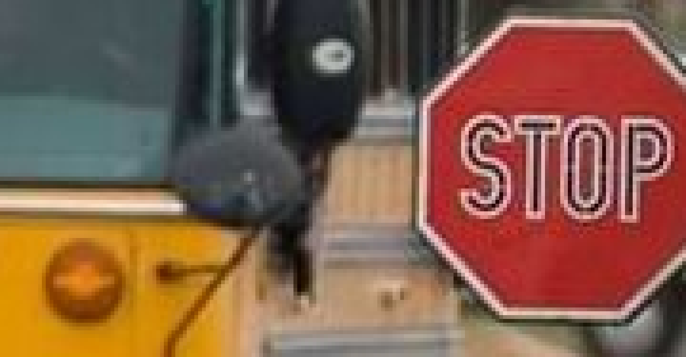
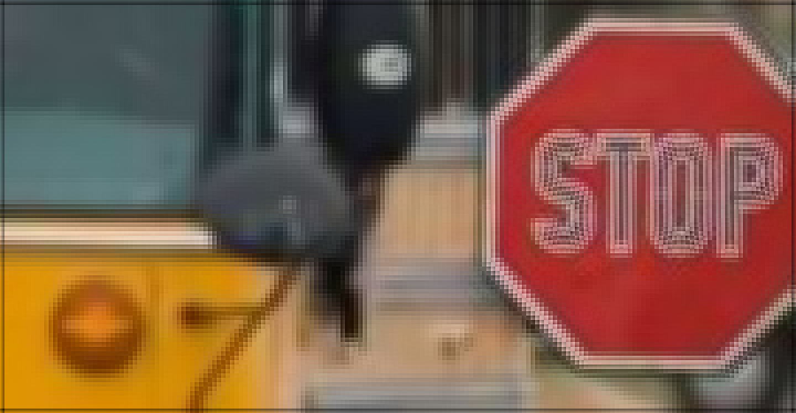
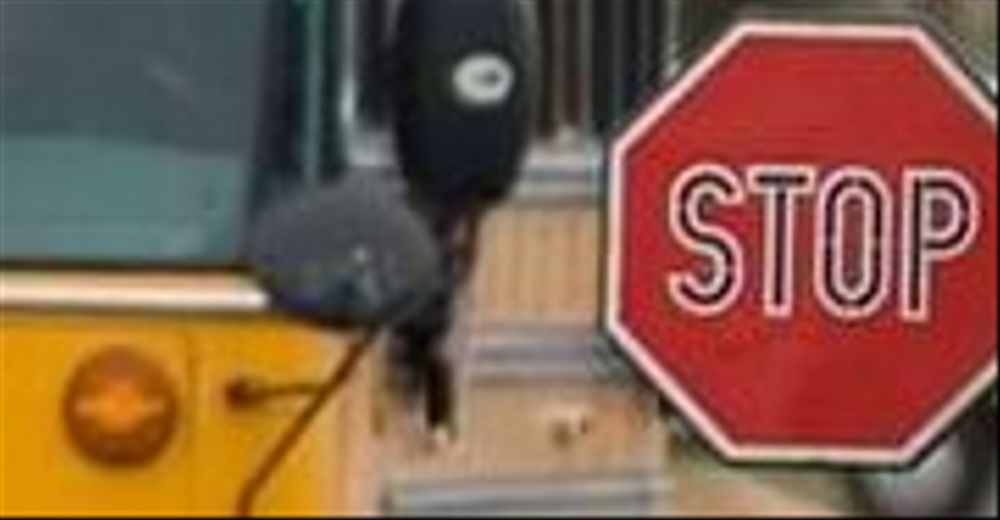

# Image Interpolation

This project demonstrates different image interpolation techniques in Python, comparing their performance in resizing and upscaling images. It includes **Nearest Neighbor**, **Bilinear**, and **Bicubic** interpolation methods and provides detailed error metrics to evaluate their accuracy.

## Features

- Implemented three interpolation methods: Nearest Neighbor, Bilinear, Bicubic  
- Quantitative error analysis: First Norm, Frobenius Norm, Infinity Norm, MSE, PSNR, RMSE, MAE  
- Interactive examples for resizing and zooming images  

## Usage

1. Place your original and downscaled images in `./images/`  
2. Run the main script:  
`python main.py`  
3. The script will display resized images using all three methods and print error metrics in the console.  

## Error Metrics

The project computes and compares the following metrics for each interpolation method:  

- First Norm  
- Frobenius Norm  
- Infinity Norm  
- Mean Squared Error (MSE)  
- Peak Signal-to-Noise Ratio (PSNR)  
- Root Mean Squared Error (RMSE)  
- Mean Absolute Error (MAE)  

## Examples

Below are example results showing **8× zoom** using each interpolation method.  

| Nearest Neighbor | Bilinear | Bicubic |
|-----------------|----------|---------|
|  |  |  |

## Results

- Shows visual differences between Nearest Neighbor, Bilinear, and Bicubic methods  
- Helps understand trade-offs between computational simplicity and accuracy  
